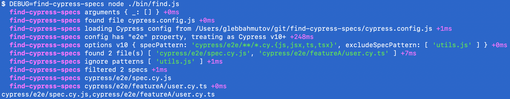

# find-cypress-specs [![renovate-app badge][renovate-badge]][renovate-app]  [](https://github.com/bahmutov/find-cypress-specs/actions/workflows/ci.yml)

> Find Cypress spec files using the config settings


```bash
$ npx find-cypress-specs
# prints all spec files separated by a comma
cypress/e2e/spec.js,cypress/e2e/featureA/user.js
```

Supports JS and TS specs

## Count

You can count the number of specs found

```bash
$ npx find-cypress-specs --count
2
```

## Component specs

By default, it finds the E2E specs and tests. You can find component specs using `--component` CLI option

```
$ npx find-cypress-specs --component
```

## against branch

By default, this module simply prints all spec filenames. You can add `--branch` parameter to only print the specs changed against that `origin/branch`.

```bash
$ npx find-cypress-specs --branch main
# prints only some specs, the ones that have changed against the "origin/main"
```

## find number of machines

If we find all the changed specs to run, we might need to decide how many machines we need. We can do a rough job by specifying the number of specs per machine plus the max number.

```
$ npx find-cypress-specs --branch main --specs-per-machine 4 --max-machines 5
```

For now, it is only useful when setting the GHA outputs.

## set GitHub Actions outputs

If you add `--set-gha-outputs` command line switch, then the number of changed specs and the comma-separated file list will be set as GH Actions outputs `changedSpecsN` and `changedSpecs`. See [pr.yml](./.github/workflows/pr.yml) for example

```yml
- name: Print specs changed against the parent of this branch 🌳
  # and set GitHub Actions output
  id: step1
  run: node ./bin/find --branch main --parent --set-gha-outputs

- name: Print set outputs
  run: echo ${{ steps.step1.outputs.changedSpecsN }} ${{ steps.step1.outputs.changedSpecs }}
```

If you set the number of machines, it will set the output `machinesNeeded`

## Write GitHub Actions job summary

You can output changes specs by using the parameter `--gha-summary`

## against the parent commit

When dealing with a long-term branch, you do not want to see the changed files in the main branch. Instead, you want to only consider the specs changed in the _current_ branch all the way to its parent commit. You can pass the flag `--parent` to only pick the modified and added specs.

```bash
$ npx find-cypress-specs --branch main --parent
# same as
# git diff --name-only --diff-filter=AMR $(git merge-base origin/main HEAD)..
```

Note: to get the changed files, we need to fetch the repo, see [pr.yml](./.github/workflows/pr.yml)

```
$ checkout
$ git fetch
$ npx find-cypress-specs --branch main --parent
```

## with traced import and require statements

Imagine you open a pull request and only change something in an `utils.js` file used by other specs. Which specs should you run? By default `--branch main --parent` would not find any changed specs, so no specs would execute, and you will have to run _all_ specs just to be safe. This program has a mode `--trace-imports <subfolder>` which uses [spec-change](https://github.com/bahmutov/spec-change) to inspect JS/TS files and find dependencies between them. Thus it can discover that when `utils.js` changes, the specs that `import './utils'` or `require('./utils')` should also be considered modified.

```
$ npx find-cypress-specs --branch main --parent --trace-imports cypress
```

**Note:** the argument is the subfolder name to limit the number of files to inspect when tracing the imports.

You can time how long tracing takes by adding option `--time-trace` to the command line arguments. You can also saved traced dependencies using `--cache-trace` argument. Next time the dependencies will be loaded from the file without recomputing. This is convenient on CI to avoid recomputing them. For example, if you need the number of affected files and their filenames

```
# get the number of affected specs
$ npx find-cypress-specs --branch main --parent --trace-imports cypress --cache-trace --count
# quickly get the affected specs without recomputing the dependencies
$ npx find-cypress-specs --branch main --parent --trace-imports cypress --cache-trace
```

The cached trace will be saved in file `deps.json`, you probably want to Git ignore it.

You can limit the number of added traced files using the `--max-added-traced-specs <N>` parameter. This avoids ALL specs added when you change some common utility that many specs import.

### number of changed files

You can print just the number of changed specs

```bash
$ npx find-cypress-specs --branch main --count
# prints the number of spec files changed against the branch "origin/main"
5
```

### filter by a tag

You can filter all changed specs and only report (and count) the specs that have changed AND include the given tag(s)

```bash
$ npx find-cypress-specs --branch main --tagged @user,@preview
# prints only some specs, the ones that have changed against the "origin/main"
# and that have any tests or suites inside tagged "@user" or "@preview"
```

You can set the list and number of specs with tags into GHA outputs

```bash
$ npx find-cypress-specs --branch main --tagged @user,@preview --set-gha-outputs
```

The number of found specs will be set as `taggedSpecsN` and the list will be set as `taggedSpecs`.

### count tagged changed specs

Let's say we changed 2 specs that have tests tagged `@user`. We can output the count by adding `--count` option

```bash
$ npx find-cypress-specs --branch main --tagged @user --count
2
```

## Test names

You can print each spec file with the suite and test names inside of it (found using [find-test-names](https://github.com/bahmutov/find-test-names))

```bash
$ npx find-cypress-specs --names
# prints something like

cypress/e2e/spec.js (2 tests)
└─ parent suite [@main]
  ├─ works well enough
  └─ inner suite
    └─ shows something [@user]

cypress/e2e/featureA/user.js (2 tests, 1 pending)
├─ works
└⊙ needs to be written

found 2 specs (4 tests, 1 pending)
```

Where the tags are listed inside `[ ... ]` (see [@bahmutov/cy-grep](https://github.com/bahmutov/cy-grep)) and the [pending tests](https://glebbahmutov.com/blog/cypress-test-statuses/) are marked with `⊙` character.

Required tags are marked with `[[ ... ]]`.

You can print the results in JSON format using `--json` or `-j` option.

You can print the tests in Markdown format using `--markdown` or `--md` option

| Spec                             |
| -------------------------------- |
| **`foo/a/spec.cy.js`** (3 tests) |
| `suite / test 1`                 |
| `suite / test 2`                 |
| `suite / test 3`                 |
| **`foo/b/spec.cy.js`** (1 test)  |
| `another / test / test 1`        |

## Test tags

You can count tags attached to the individual tests using `--tags` arguments

```
$ npx find-cypress-specs --tags
# prints the tags table sorted by tag

Tag    Tests
-----  ----------
@sign  1
@user  2
```

Each tag count includes the tests that use the tag directly, and the _effective_ tags applied from the parent suites, both `tags` and `requiredTags`.

You can print the results in JSON format using `--json` or `-j` option.

## Test names filtered by a tag

```bash
$ npx find-cypress-specs --names --tagged <single tag>
# finds all specs and tests, then filters the output by a single tag
```

## Test names filtered by multiple tags

```bash
$ npx find-cypress-specs --names --tagged <tag1>,<tag2>,<tag3>,...
# finds all specs and tests, then filters the output showing all tests
# tagged with tag1 or tag2 or tag3 or ...
```

## File names filtered by a tag

```
$ npx find-cypress-specs --tagged <single tag>
# finds all specs and tests, then filters the output showing only the file names associated with the tests


# cypress/e2e/spec.cy.js,cypress/e2e/featureA/user.cy.ts
```

If you pass an empty string argument like `--tagged ''`, an empty list is returned.

You can print the number of found tagged specs by adding `--count` argument

```
$ npx find-cypress-specs --tagged <single tag> --count
3
```

## File names filtered by multiple tags

```
$ npx find-cypress-specs --tagged <tag1>,<tag2>,<tag3>,...
# finds all specs and tests, then filters the output showing only the file names associated with the tests
# tagged with tag1 or tag2 or tag3 or ...
```

## Show only the pending tests

You can show only the tests marked with "it.skip" which are called "pending" according to Mocha / Cypress [terminology](https://glebbahmutov.com/blog/cypress-test-statuses/).

```bash
$ npx find-cypress-specs --names --pending
# --skipped is an alias to --pending
$ npx find-cypress-specs --names --skipped
# prints and counts only the pending tests
cypress/e2e/featureA/user.cy.ts (1 test, 1 pending)
└⊙ needs to be written [@alpha]

found 1 spec (1 test, 1 pending)
```

## Print skipped tests

```
$ npx find-cypress-specs --names --skipped
```

Prints each spec that has skipped tests.

## Count tests

You can see the total number of E2E and component tests

```
$ npx find-cypress-specs --test-counts
4 e2e tests, 2 component tests
```

### Update README badge

You can set or update a badge in README with test counts by adding the `--update-badge` argument

```
$ npx find-cypress-specs --test-counts --update-badge
4 e2e tests, 2 component tests
⚠️ Could not find test count badge
Insert new badge on the first line
saving updated readme with new test counts
```

See the [badges.yml workflow](./.github/workflows/badges.yml)

## Count skipped tests

Prints the single number with the count of skipped tests

```
$ npx find-cypress-specs --names --skipped --count

5
```

## cypress.config.ts

If the project uses TypeScript and `cypress.config.ts` then this module uses [tsx](https://github.com/privatenumber/tsx) to load the config and fetch the spec pattern.

If you are using `import` keyword in your `cypress.config.ts` you might get an error like this:

```
import { defineConfig } from 'cypress';
^^^^^^

SyntaxError: Cannot use import statement outside a module
```

In that case, add to your `tsconfig.json` file the `ts-node` block:

```json
{
  "ts-node": {
    "compilerOptions": {
      "module": "commonjs"
    }
  }
}
```

See example in [bahmutov/test-todomvc-using-app-actions](https://github.com/bahmutov/test-todomvc-using-app-actions).

**Tip:** read my blog post [Convert Cypress Specs from JavaScript to TypeScript](https://glebbahmutov.com/blog/cypress-js-to-ts/).

## Custom config filename

If you want to use a custom Cypress config, pass it via the environment variable `CYPRESS_CONFIG_FILE`

```
$ CYPRESS_CONFIG_FILE=path/to/cypress.config.js npx find-cypres-specs ...
```

## Absolute spec filenames

You can return absolute filenames to the found specs

```js
getSpecs(config, 'e2e|component', true)
```

## Details

Cypress uses the resolved [configuration values](https://on.cypress.io/configuration) to find the spec files to run. It searches the `integrationFolder` for all patterns listed in `testFiles` and removes any files matching the `ignoreTestFiles` patterns.

You can see how Cypress finds the specs using `DEBUG=cypress:cli,cypress:server:specs` environment variable to see verbose logs. The logic should be in the file `packages/server/lib/util/specs.ts` in the repo [cypress-io/cypress](https://github.com/cypress-io/cypress)

## Debugging

Run the utility with environment variable `DEBUG=find-cypress-specs` to see the verbose logs



Finding tests in the individual specs uses [find-test-names](https://github.com/bahmutov/find-test-names) so you might want to enable debugging both modules at once:

```
$ DEBUG=find-cypress-specs,find-test-names npx find-cypress-specs --names
```

To debug finding changed specs against a branch, use `find-cypress-specs:git`

```
$ DEBUG=find-cypress-specs:git npx find-cypress-specs --branch main
```

## Videos

- [Use Ava Snapshots And Execa-wrap To Write End-to-End Tests For CLI Utilities](https://youtu.be/rsw17RqP0G0)

## Examples

- 📝 blog post [Run Changed Traced Specs On GitHub Actions](https://glebbahmutov.com/blog/trace-changed-specs/)
- 📝 blog post [Quickly Run The Changed Specs on GitHub Actions](https://glebbahmutov.com/blog/quick-changed-specs/)
- [chat.io](https://github.com/bahmutov/chat.io) as described in the blog post [Get Faster Feedback From Your Cypress Tests Running On CircleCI](https://glebbahmutov.com/blog/faster-ci-feedback-on-circleci/)

## NPM module

You can use this module via its NPM module API.

### getSpecs

```js
const { getSpecs } = require('find-cypress-specs')
// somewhere in the cypress.config.js
setupNodeEvents(on, config) {
  const specs = getSpecs(config)
  // specs is a list of filenames
}
```

You can pass the `config` object to the `getSpecs` method. If there is no `config` parameter, it will read the config file automatically.

```js
const specs = getSpecs({
  e2e: {
    specPattern: '*/e2e/featureA/*.cy.ts',
  },
})
// ['cypress/e2e/featureA/spec.cy.ts']
```

### getTests

Returns an object with individual test information

```js
const { getTests } = require('find-cypress-specs')
const { jsonResults, tagTestCounts } = getTests()
// jsonResults is an object
// with an entry per spec file
```

See [get-tests.js](./test/npm/get-tests.js) for details and examples.

## Small print

Author: Gleb Bahmutov &lt;gleb.bahmutov@gmail.com&gt; &copy; 2022

- [@bahmutov](https://twitter.com/bahmutov)
- [glebbahmutov.com](https://glebbahmutov.com)
- [blog](https://glebbahmutov.com/blog)
- [videos](https://www.youtube.com/glebbahmutov)
- [presentations](https://slides.com/bahmutov)
- [cypress.tips](https://cypress.tips)
- [Cypress Tips&Tricks](https://cypresstips.substack.com/) newsletter
- [my Cypress courses](https://cypress.tips/courses)

License: MIT - do anything with the code, but don't blame me if it does not work.

Support: if you find any problems with this module, email / tweet /
[open issue](https://github.com/bahmutov/find-cypress-specs/issues) on Github

## MIT License

Copyright (c) 2022 Gleb Bahmutov &lt;gleb.bahmutov@gmail.com&gt;

Permission is hereby granted, free of charge, to any person
obtaining a copy of this software and associated documentation
files (the "Software"), to deal in the Software without
restriction, including without limitation the rights to use,
copy, modify, merge, publish, distribute, sublicense, and/or sell
copies of the Software, and to permit persons to whom the
Software is furnished to do so, subject to the following
conditions:

The above copyright notice and this permission notice shall be
included in all copies or substantial portions of the Software.

THE SOFTWARE IS PROVIDED "AS IS", WITHOUT WARRANTY OF ANY KIND,
EXPRESS OR IMPLIED, INCLUDING BUT NOT LIMITED TO THE WARRANTIES
OF MERCHANTABILITY, FITNESS FOR A PARTICULAR PURPOSE AND
NONINFRINGEMENT. IN NO EVENT SHALL THE AUTHORS OR COPYRIGHT
HOLDERS BE LIABLE FOR ANY CLAIM, DAMAGES OR OTHER LIABILITY,
WHETHER IN AN ACTION OF CONTRACT, TORT OR OTHERWISE, ARISING
FROM, OUT OF OR IN CONNECTION WITH THE SOFTWARE OR THE USE OR
OTHER DEALINGS IN THE SOFTWARE.

[renovate-badge]: https://img.shields.io/badge/renovate-app-blue.svg
[renovate-app]: https://renovateapp.com/
